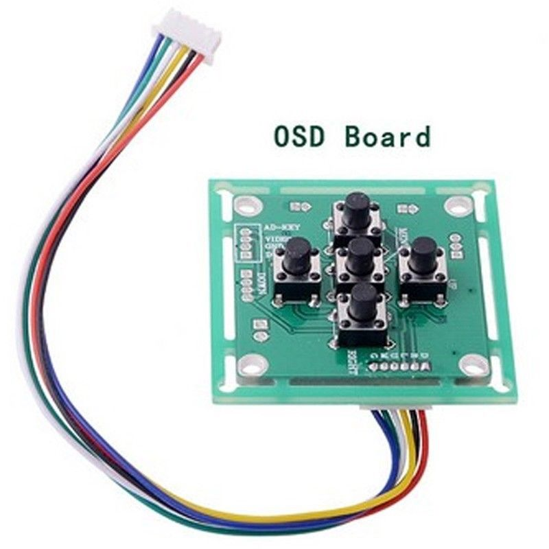

# CCDOSD

CCD cameras have an OSD for changing settings. I am investigating how these work.

My end goal is to allow a single wire connection from an STM32 based multicopter
flight controller and a CCD camera, allowing the flight controller to pass "button
presses" to the camera.

This will allow in-field adjustment of camera setting using one's RC transmitter
and FPV goggles.

First, I need to figure out the "protocol" or electrical interface these cameras
expect.

# Protocol

The OSD control boards have five buttons. There are a number of resistors on the
board.



I was able to find a DIY version of these boards...

https://www.cloudynights.com/topic/389830-lntech-300-shrink-down-wired-remote-control/#entry4988665

I will preserve the relevant bits here.

5 buttons, 4 resistors...

 - 15KOhm (top)
 - 27KOhm (right)
 - 56KOhm (bottom)
 - 6.8KOhm (center)
 - 0 Ohm (left)

Buttons are all wired to two common terminals, one is power source, the other is
the signal wire. Between each button and the signal wire is a resistor (or not in
the case of the left button). This means when each button is pressed, the signal
wire will receive a different voltage/current.

And another similar one...

http://www.instructables.com/id/Adding-remote-OSD-button-control-to-the-SuperCircu/

This one simply wires transistors in parallel with the existing buttons, allowing
the arduino to simulate a button press. The original resistors then do their job.

# Arduino control

The first step is to try to emulate the control board using an arduino. There are
two possibilities:

 - Use an analog pin on an arduino to output the desired voltage. An arduino can
   only handle a small current on an analog output pin. Depending on the current
   drawn by the camera, this may be issufficient. Also, the analog output is PWM,
   which may or may not work.

```
              +------+
  [5V]--------| Ar   |     +----------+
              |  du  |--A0-|          |
              |   in |     |    CAM   |
            +-|    o |   +-|          |
            | +------+   | +----------+
  [GND]-----+------------+
```

 - Use a resistor network with transistors or shift register that can utilize
   digital pins to emulate button presses.

http://www.toptechboy.com/arduino/lesson-8-writing-analog-voltages-in-arduino/

If I am lucky, this will work, and the interface will be super simple. All that
will be required is a single analog output pin. If not, more circuitry will be
required to allow generating the proper signal.

```
           +-------------------+               +----------+
           |  +------+         |          +----|          |
  [5V]-----+--| Ar   |       +---+        |    |    CAM   |
              |  du  |--D0---| S |--[R0]--+  +-|          |
              |   in |--D1---| h |--[R1]--+  | +----------+
            +-|    o |--D2---| i |--[R2]--+  |
            | +------+       | f |--[R3]--+  |
  [GND]-----+--------------+ | t |--------+  |
                           | +---+           |
                           |   |             |
                           +---+-------------+
```

To switch 5 different outputs, one must use a shift register in combination with
a transistor array and some resistors. Here is more information on using shift
registers.

https://www.arduino.cc/en/Tutorial/ShiftOut
https://labalec.fr/erwan/?p=1288
https://labalec.fr/erwan/?p=1275

In this case, we will probably want a custom PCB to house the necessary components
this is no longer a 1-wire interface.

https://learn.sparkfun.com/tutorials/using-eagle-schematic
https://learn.sparkfun.com/tutorials/using-eagle-board-layout

# Flight Controller

The final step would be to provide the following functionality into the flight
controller firmware.

 - A new stick command to enter "camera OSD" mode. The same stick command would
   also exit this mode.
 - Upon entering "camera OSD" mode, send the signal to the camera via the above
   device to bring up the OSD menu.
 - Monitor RC input and send appropriate navigation signals to the camera.
 - The user may exit the OSD via it's menu, in which case we need to allow them
   to exit "camera OSD" mode (via stick command).

Would also need to locate convenient pins for connection to the OSD control
device. Would need to take into account different flight controllers, their
available connections and the pins they are wired to. Could optionally use UART
communication so that serial/softserial ports can be utilized.